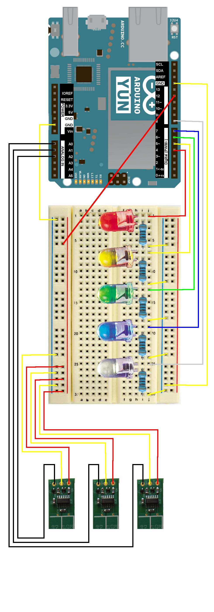

# YunFreq
measure the frequency of one up to six capacitive humidity sensor and make decisions for watering (ArduinoYùn)

## Requirements
- Arduino Yùn
- microSD-Card

## Installation
The both sides of the Yùn must be installed properly
### For the Yùn-side:
The Yùn needs to be in your local network and connected to the internet.
The SD-card need to be integrated properly. Use the "[Yún Disk Space Expander](http://www.arduino.cc/en/Tutorial/ExpandingYunDiskSpace)" and follow the instrudtions.
Copy the `install.sh` script into the root of your sd-card and execute it. This will install php and configure the uhttpd apropriate. MySQL will be installed. too with the data-directory on the sd-card.

## Usage
At the current status the sample usage with a breadborad and LEDs can be seen here:

The LEDs are showing the grade of dryness for the last triggered sensor.

